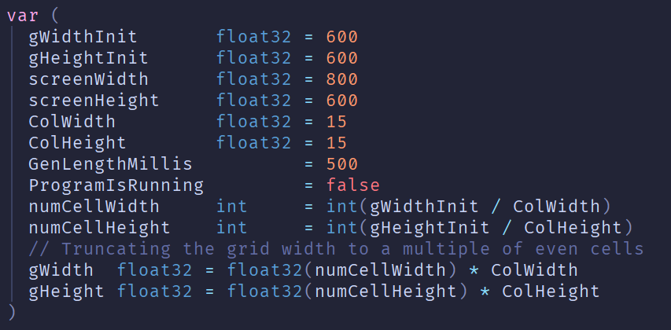

# Game of Life 2D

This is a project written in [Golang](https://go.dev/) in order to practice creating a GUI application utilizing Go and [Fyne.io](https://fyne.io/)

This project implements [Conway's Game of Life](https://en.wikipedia.org/wiki/Conway%27s_Game_of_Life) on a standard 2 dimensional grid


---

# Installation

Go [here](https://go.dev/doc/install) and follow the directions for your system to install Go

```
git clone https://github.com/matthew-teetshorn/GameOfLife2D
```

Navigate to the downloaded project directory, likely _GameOfLife2D_

```
go mod tidy
go run .
```

This will download the required modules as specified in go.mod (mostly for [Fyne.io](https://fyne.io/))

---

# Simulation settings



The simulation settings can be modified before building/running the project to test out different capabilities.

The game grid is generated dynamically at runtime as a function of gWidthInit/gHeightInit and the ColWidth/ColHeight variables. The grid itself is generated as the largest number of whole squares that will fit in the desired height and width so no partial squares are created if the chosen values do not multiply evenly.

GenLengthMillis controls the length, in milliseconds, between calculating generations to speed up and slow down the simulation.

screenWidth/screenHeight establish an initial ratio of the size of the full window. Due to the Fyne _Device Independent Pixel_ implementation, this is not necessarily the actual screen size, but the ratio will be accurate. The game window can be resized at runtime and will behave as expected.

---

# To Do

- [ ] Add game stats to the runtime window (i.e. #generations, #born, #died, etc.)
- [ ] Add hooks in the UI to allow modification of the simulation paramaters during runtime rather then through the source code
- [ ] Add pregenerated shapes as an option to bypass manual entry
- [ ] Add an image upload functionality to allow bitmaps to be brought in as grid designs
- [ ] Modify the interface to clean up state passing to functions. Combination of global state vars function params is a bit messy.
